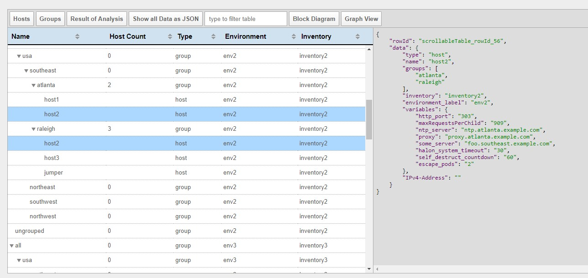

# Ansible Inventory Browser
This project can parse ansible inventories and display them graphically on a webpage.

## Features
* Parses Inventories
  * Some error, warning and messages about the inventory structur and concent will be displayed.
  * Generates one consistent data structure for the WebUI.
* WebUI
  * What can be seen on the WebUI:
    * **Host list**
      * Columns can be sorted.
    * **Groups and hosts treeview**
    * List of **parser information**
    * Whole **structured WebUI data** as json
    * **Detail view** which shows all information about selected hosts or groups
      * In the treeview (Group View) also inherited information (e.g. variables will be displayed on every level)
  * **Custom Columns** in Host and Group View can be configured.
    * All attributes in the whole structure can be configured. (As example in the host view you can add a column about the iLO IP Address which is available but distributed in files called network under the folder host_vars.)
      
### Planned features
* JSON highliting
* Make inherited values visible.
* Search function for table contnet.
* Sort function for treeview (Group List)
* Splitter btw tables and detail view.
* Ability to add custom functions which can convert or enricht information to be displayed.
* Autodetection if inventories change so that the structed data for the WebUI will be parsed again. (This shall be built-in the webserver part)
* Configuration of custom columns shall be dynamic and also possible after parsing the inventories so that a use can change them while browsing.
* WebUI for generating settings file


## Browse through the example inventories
There are some [example inventories](/example-inventories) within this project and their data for the webUI is pregenerated. If you want to check out how this tool works just:
* Clone this repository: **`git clone https://github.com/grimmpp/ansible-inventory-browser.git`**
* and open the **[/webpage/index.html](/webpage/index.html)**

In order to check out the [example inventories](/example-inventories) nothing except a browser is needed. The webpage consists of pure html and javascript and the data for the example inventories is pregenerated within the webpage folder.

This is how it will look like: <br/>


## How it works

This project consists of:
* a **[tool - main.js](/main.js)** which parses your inventories and generates structured data.
* a **[static webpage](/webpage/index.html)** which shows the generated and structured data from the ansible inventories.
* a **[node.js server - server.js](/server.js)** which can serve the webpage. (The webserver is optional because the whole webpage is static.) You can start the server with: **`node server.js`** and the webpage will be available under: http://localhost:5000
* a **[dockerfile](/Dockerfile)** which builds everything and starts the webserver so that you can test it consistently without having the need to install e.g. node.js.


## Generate webUI data for your own inventories

To generate your own JSON data you can use the following command: <br />
```bash
node ./main.js -c YOUR_CONFIG_FILE
```
Before generating the data you need to specify a settings file which contains the configuration about the data which shall be displayed, the location of your inventories, and some settings about how to prepare the information of the inventories. 
As example see the [prepared configuration](/inventory.conf) file of the [example inventories](/example-inventories).

Data for the example inventories can be generated with:
```
node main.js -c inventory.conf 
```

The output file will be written into [/webpage/generated-data/data.js](/webpage/generated-data/data.js).

After generating the data you can browse it through on the webpage: [/webpage/index.html](/webpage/index.html)


## Running in Docker

For those of you who don't have `node` installed on their machine, you can run everything inside a Docker container.

## How to build the docker image

First *build* the container for the inventory browser via

```bash
docker build -t ansible-inventory-browser .
```

## How to run the docker container

You can then *run* the container to generate the data (as a one-off command) via

```bash
docker run -p 8000:8000 -d ansible-inventory-browser
```
*Hint:* If you use docker toolbox under windows don't forget to create a port-forward for the docker host VM. (8000->8000)

## Browse your own Inventories

If you want to generated the data for your *own inventories* then just mount them into the container like this:
```bash
docker run -it \
 -v PATH_TO_YOUR_DATA:/extData \  # readonly is sufficient
 -e ANSIBLE_INVENTORY=/extData/myInventory.conf \
 -p 8000:8000 \
 ansible-inventory-browser
```

where

* `-v PATH_TO_YOUR_DATA:/extData` mounts the directory which contains your inventories so that the node process within the container can read the data. Readonly access is sufficient.
* `-e ANSIBLE_INVENTORY=/extData/myInventory.conf` defines the config file in which you defines the inventories to be parsed and how the webUI shall look like.
* `-p 8000:8000` Makes the exposed webserver port inside the container available and maps it to the same port. <br />
*Hint:* If you use docker toolbox under windows don't forget to configure a port-forwarding for your docker host VM.

Afterwards, you can open **http://localhost:8000** from your local machine in your browser.
